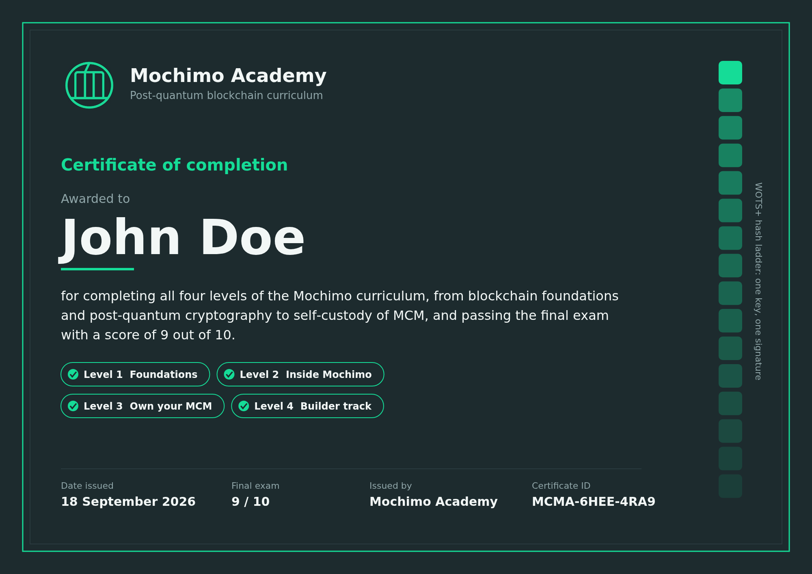
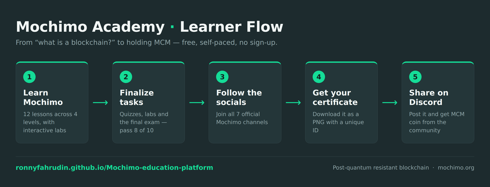

# Mochimo Academy

A free, self-paced learning platform about **Mochimo (MCM)**, the post-quantum resistant blockchain. It takes learners from "what is crypto?" to holding MCM in a wallet they control, with an optional builder track for node runners, miners and developers.



## Learner flow



1. **Learn Mochimo.** Work through the lessons, from what a ledger is up to self-custody, plus the optional builder track. Progress saves in your browser as you go.
2. **Finalize the tasks.** Answer the comprehension questions, try the interactive labs, then take the 10-question final exam. You need **8 of 10** to pass; retakes are unlimited.
3. **Follow Mochimo on social media.** Passing the exam unlocks a requirements step. Join every channel below, then confirm each one — the three with a username field are how the community can find you.

   | Channel | What to do | How you confirm |
   |---|---|---|
   | [X (Twitter)](https://x.com/mochimocrypto) | Follow @mochimocrypto | enter your X username |
   | [Telegram](https://t.me/mochimocryptochat) | Join the Mochimo chat | enter your Telegram username |
   | [Discord](https://discord.mochimo.org/) | Join the Mochimo server | enter your Discord username |
   | [TikTok](https://www.tiktok.com/@mochimoarmy) | Follow @mochimoarmy | tick the box |
   | [Instagram](https://www.instagram.com/mochimoquantum/) | Follow @mochimoquantum | tick the box |
   | [YouTube](https://www.youtube.com/@mochimoofficial) | Subscribe to @mochimoofficial | tick the box |
   | [YouTube](https://www.youtube.com/@MochimoEducation) | Subscribe to @MochimoEducation | tick the box |

4. **Get your certificate.** Once the exam is passed and all seven channels are confirmed, type your name and download the certificate as a PNG. It carries your score, the date and a unique certificate ID.
5. **Share it in Mochimo Discord.** Post your certificate in the [Mochimo Discord](https://discord.mochimo.org/) to get some **MCM coin** as a reward from the community.

## Curriculum

| Level | Audience | Lessons |
|---|---|---|
| 1. Foundations | Complete beginners | Ledgers and blockchains · Keys and wallets · The quantum threat |
| 2. Inside Mochimo | After Level 1 | Hashes and WOTS+ · Tags and v3 addresses · The network (ChainCollapse, supply, units) |
| 3. Own your MCM | Hands-on | Getting MCM · Wallet setup · Moving MCM into self-custody |
| 4. Builder track | Optional, technical | Running a relay node · GPU mining · Mesh API |

## Features

- 12 lessons with learning objectives and 2 comprehension questions each
- Interactive labs: live SHA-256 hashing, a WOTS+ hash-ladder key-reuse demo, and an MCM ↔ nanoMCM converter
- Searchable glossary of 24 terms, linked back to lessons
- 10-question final exam (pass mark 8/10)
- Community step: the certificate unlocks only after all 7 Mochimo channels are confirmed
- Shareable certificate rendered as a 2000 × 1414 PNG, with a prompt to claim an MCM reward in Discord
- Light and dark themes, responsive down to mobile
- Progress saved locally in the learner's browser (no backend, no tracking)

## Run it

It is a single static file with no build step.

- **Locally:** open `index.html` in a browser.
- **GitHub Pages:** Settings → Pages → Deploy from branch → `main` / root. The site will be live at `https://ronnyfahrudin.github.io/Mochimo-education-platform/`.

## Project structure

```
index.html                  the whole platform (HTML, CSS, JS, inlined logo)
assets/mochimo-logo.jpg     Mochimo logo
assets/certificate-sample.png  example certificate
```

## Notes

- Certificate IDs are unique but not verifiable, because progress is stored only in the learner's browser.
- The social media step is self-attested in the browser; the usernames are not checked against the platforms. Verification happens in Discord when the certificate is shared.
- MCM rewards come from the Mochimo community, not from this platform. Amounts and availability are at the community's discretion.
- Exchange listings change, so the course points learners to live market pages instead of naming an exchange.
- Always verify links through [mochimo.org](https://mochimo.org).

## License

[MIT](LICENSE) — the Mochimo name and logo belong to the Mochimo project.

Educational material only, not financial advice.
